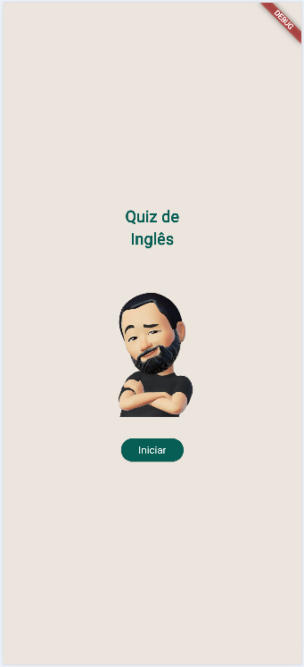
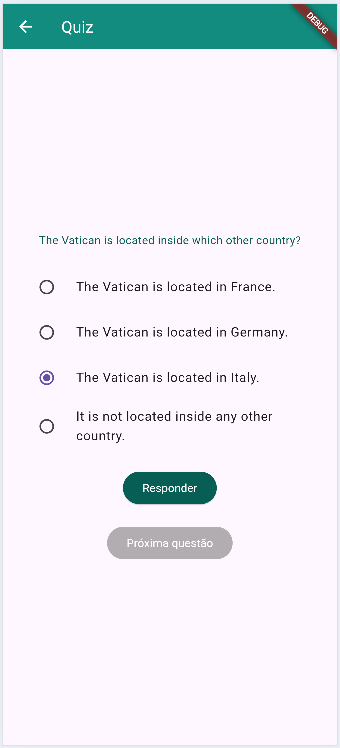
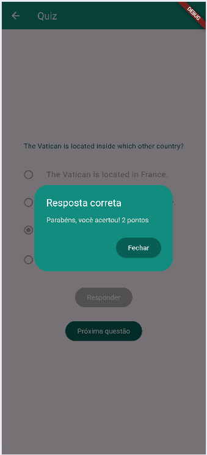

# Quiz

App simples de quiz que consome dados de uma Mockup API **JSON** hospedada em um repositorio *github* com questões de inglês do tipo alternativa e preencher lacuna.

## Tecnologias
- Flutter
- VsCode
- Android Studio

|Efeitos|WidGets|
|-|:-:|
|Tema|ThemeData.light().copyWith()|
|Imagens|Image.asset()|
|Assincronicidade|async|
|Carregar dados de API http|http.get("url")|
|Conversão de dados|json.encode(), json.decode()|
|Opções|RadioGroup() RadioListTile()|
|Botões de controle de conteúdos em tela|ElevatedButton()|
|[Arrastar e soltas](./drag.md)|Draggable()DragTarget()|

# Para testar
- 1 Clone o repositório
- 2 Abra com VsCode, Abra o trminal **CTRL + "**, execute o comando `flutter pub get` para instalar as dependências
- 3 Navegue até o arquivo lib/main.dart e dê **play** ou execute o comando `flutter run` para rodar o projeto
- 4 Escolha navegador ou um emulador para testar, ou abra o arquivo */lib/main.dart* e clique em Play.

||||
|:-:|:-:|:-:|
|Splash|Questões|Alternativa|