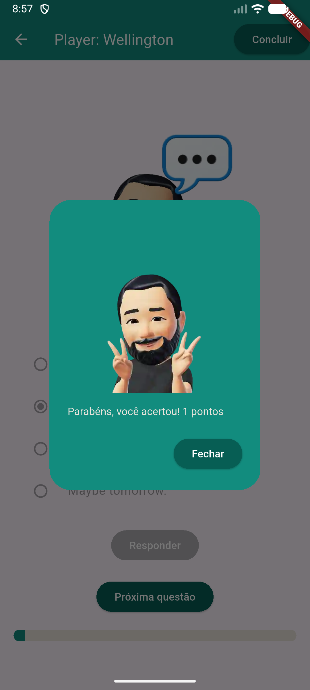
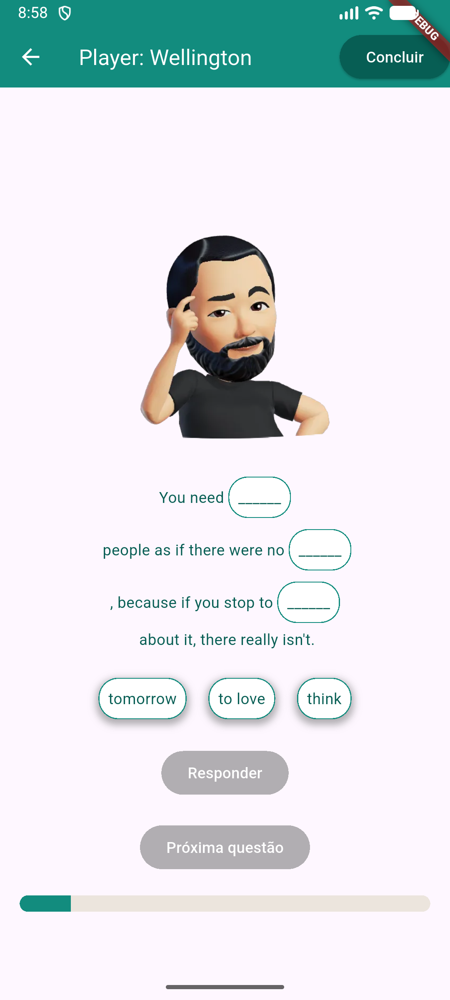
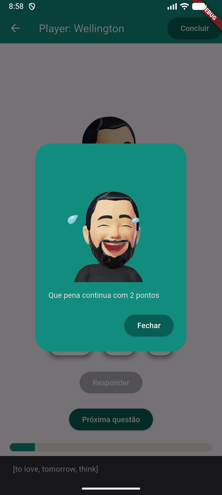
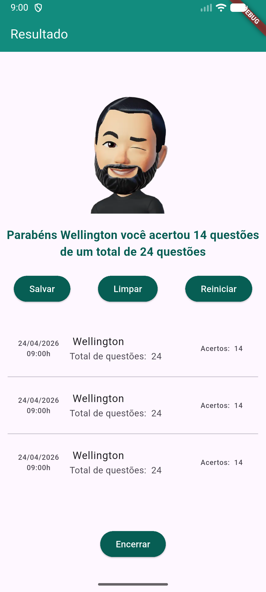

# Quiz

App simples de quiz que consome dados de uma Mockup API **JSON** hospedada em um repositorio *github* com questões de inglês do tipo alternativa e preencher lacuna.

## Tecnologias
- Flutter
- VsCode
- Android Studio

|Efeitos|WidGets|
|-|:-:|
|Tema|ThemeData.light().copyWith()|
|Imagens|Image.asset()|
|Assincronicidade|async|
|Carregar dados de API http|http.get("url")|
|Conversão de dados|json.encode(), json.decode()|
|Opções|RadioGroup() RadioListTile()|
|Botões de controle de conteúdos em tela|ElevatedButton()|
|[Arrastar e soltar](./drag.md)|Draggable()DragTarget()|

# Para testar
- 1 Clone o repositório
- 2 Abra com VsCode, Abra o trminal **CTRL + "**, execute o comando `flutter pub get` para instalar as dependências
- 3 Navegue até o arquivo lib/main.dart e dê **play** ou execute o comando `flutter run` para rodar o projeto
- 4 Escolha navegador ou um emulador para testar, ou abra o arquivo */lib/main.dart* e clique em Play.

## [Download apk](./assets/app-release.apk)

||||
|:-:|:-:|:-:|
|Splash|Questões|Alternativa|

||||
|:-:|:-:|:-:|
|Acerto|Lacunas|Erro|

|Tela de resultados|Desafio|
|:-:|-|
||- 1 Faça **fork** deste repositório e implemente um sistema de pontuação, onde o usuário ganha pontos por cada resposta correta e perde pontos por cada resposta incorreta. No final do quiz, exiba a pontuação total do usuário. - 2 Adicione um temporizador para cada pergunta, onde o usuário tem um tempo limitado para responder. Se o tempo acabar, a resposta é considerada incorreta e o quiz avança para a próxima pergunta. - Melhore o drag and drop, permitindo que o usuário possa arrastar e soltar cada opção apenas uma vez, ficando com uma cor mais opaca após ser arrastada e solta. **Entrega** Ao concluir as implementações, faça commit das suas alterações e envie um pull request para este repositório. Certifique-se de incluir uma descrição clara das mudanças que você fez e como elas melhoram o quiz.|